# UML Use Case Diagram - Medical Management System

## Tổng Quan

Sơ đồ Use Case UML mô tả tổng quan tất cả các chức năng (use cases) và các tác nhân (actors) trong hệ thống quản lý y tế. Sơ đồ này giúp hiểu rõ phạm vi hệ thống và mối quan hệ giữa người dùng và chức năng.

## Use Case Diagram - Tổng Quan Hệ Thống

```mermaid
graph TB
    %% Actors - Hình người (Actor stick figure representation)
    ADMIN(( :👤<br/>Admin<br/>Quản trị viên :))
    DOCTOR(( :👨‍⚕️<br/>Doctor<br/>Bác sĩ :))
    PATIENT(( :👤<br/>Patient<br/>Bệnh nhân :))
    SYSTEM(( :⚙️<br/>System<br/>Hệ thống :))
    
    %% System Boundary - Hệ thống quản lý y tế
    subgraph SYS["Medical Management System"]
        %% Admin Use Cases - Hình tròn/oval
        UC_ADMIN_001(("Quản Lý<br/>Người Dùng"))
        UC_ADMIN_002(("Quản Lý<br/>Chuyên Khoa"))
        UC_ADMIN_003(("Quản Lý<br/>Thuốc"))
        UC_ADMIN_004(("Xem Báo Cáo<br/>Tổng Quan"))
        UC_ADMIN_005(("Quản Lý<br/>Đơn Thuốc"))
        
        %% Doctor Use Cases - Hình tròn/oval
        UC_DOCTOR_001(("Quản Lý<br/>Bệnh Nhân"))
        UC_DOCTOR_002(("Kê Đơn Thuốc<br/>Điện Tử"))
        UC_DOCTOR_003(("Chỉnh Sửa<br/>Đơn Thuốc"))
        UC_DOCTOR_004(("Giám Sát Tuân Thủ<br/>Uống Thuốc"))
        UC_DOCTOR_005(("Xem Lịch Sử<br/>Điều Trị"))
        
        %% Patient Use Cases - Hình tròn/oval
        UC_PATIENT_001(("Xem<br/>Đơn Thuốc"))
        UC_PATIENT_002(("Xem Lịch Nhắc<br/>Uống Thuốc"))
        UC_PATIENT_003(("Xác Nhận Đã<br/>Uống Thuốc"))
        UC_PATIENT_004(("Đánh Dấu<br/>Bỏ Lỡ Thuốc"))
        UC_PATIENT_005(("Xem Lịch Sử<br/>Dùng Thuốc"))
        UC_PATIENT_006(("Quản Lý Hồ Sơ<br/>Bệnh Án"))
        
        %% System Use Cases - Hình tròn/oval
        UC_SYSTEM_001(("Gửi Nhắc Nhở<br/>Uống Thuốc"))
        UC_SYSTEM_002(("Tạo Cảnh Báo<br/>Tuân Thủ Thấp"))
        UC_SYSTEM_003(("Xử Lý WebSocket<br/>Connections"))
    end
    
    %% Associations - Nét liền (solid line) giữa Actors và Use Cases
    ADMIN ---|>| UC_ADMIN_001
    ADMIN ---|>| UC_ADMIN_002
    ADMIN ---|>| UC_ADMIN_003
    ADMIN ---|>| UC_ADMIN_004
    ADMIN ---|>| UC_ADMIN_005
    
    DOCTOR ---|>| UC_DOCTOR_001
    DOCTOR ---|>| UC_DOCTOR_002
    DOCTOR ---|>| UC_DOCTOR_003
    DOCTOR ---|>| UC_DOCTOR_004
    DOCTOR ---|>| UC_DOCTOR_005
    
    PATIENT ---|>| UC_PATIENT_001
    PATIENT ---|>| UC_PATIENT_002
    PATIENT ---|>| UC_PATIENT_003
    PATIENT ---|>| UC_PATIENT_004
    PATIENT ---|>| UC_PATIENT_005
    PATIENT ---|>| UC_PATIENT_006
    
    SYSTEM ---|>| UC_SYSTEM_001
    SYSTEM ---|>| UC_SYSTEM_002
    SYSTEM ---|>| UC_SYSTEM_003
    
    %% Dependencies - Nét đứt (dashed line) cho relationships
    UC_DOCTOR_002 -.->|"&lt;&lt;triggers&gt;&gt;"| UC_PATIENT_001
    UC_DOCTOR_004 -.->|"&lt;&lt;monitors&gt;&gt;"| UC_PATIENT_003
    UC_SYSTEM_001 -.->|"&lt;&lt;triggers&gt;&gt;"| UC_PATIENT_003
    UC_SYSTEM_002 -.->|"&lt;&lt;notifies&gt;&gt;"| UC_DOCTOR_004
    
    %% Styling - Actors (hình người) màu xanh
    style ADMIN fill:#4a90e2,stroke:#2e5c8a,stroke-width:3px,color:#fff
    style DOCTOR fill:#50c878,stroke:#2e7d4e,stroke-width:3px,color:#fff
    style PATIENT fill:#ff6b9d,stroke:#c44569,stroke-width:3px,color:#fff
    style SYSTEM fill:#9b59b6,stroke:#6c3483,stroke-width:3px,color:#fff
    
    %% Styling - Use Cases (hình tròn) màu vàng cam
    style UC_ADMIN_001 fill:#ffe66d,stroke:#333,stroke-width:2px
    style UC_ADMIN_002 fill:#ffe66d,stroke:#333,stroke-width:2px
    style UC_ADMIN_003 fill:#ffe66d,stroke:#333,stroke-width:2px
    style UC_ADMIN_004 fill:#ffe66d,stroke:#333,stroke-width:2px
    style UC_ADMIN_005 fill:#ffe66d,stroke:#333,stroke-width:2px
    
    style UC_DOCTOR_001 fill:#a8e6cf,stroke:#333,stroke-width:2px
    style UC_DOCTOR_002 fill:#a8e6cf,stroke:#333,stroke-width:2px
    style UC_DOCTOR_003 fill:#a8e6cf,stroke:#333,stroke-width:2px
    style UC_DOCTOR_004 fill:#a8e6cf,stroke:#333,stroke-width:2px
    style UC_DOCTOR_005 fill:#a8e6cf,stroke:#333,stroke-width:2px
    
    style UC_PATIENT_001 fill:#d4f1f4,stroke:#333,stroke-width:2px
    style UC_PATIENT_002 fill:#d4f1f4,stroke:#333,stroke-width:2px
    style UC_PATIENT_003 fill:#d4f1f4,stroke:#333,stroke-width:2px
    style UC_PATIENT_004 fill:#d4f1f4,stroke:#333,stroke-width:2px
    style UC_PATIENT_005 fill:#d4f1f4,stroke:#333,stroke-width:2px
    style UC_PATIENT_006 fill:#d4f1f4,stroke:#333,stroke-width:2px
    
    style UC_SYSTEM_001 fill:#ffd3b6,stroke:#333,stroke-width:2px
    style UC_SYSTEM_002 fill:#ffd3b6,stroke:#333,stroke-width:2px
    style UC_SYSTEM_003 fill:#ffd3b6,stroke:#333,stroke-width:2px
    
    %% System boundary styling
    style SYS fill:#f0f0f0,stroke:#333,stroke-width:3px,stroke-dasharray: 5 5
```

## Use Case Diagram - Phân Rã Chi Tiết (Decomposition)

### 1. Admin - Quản Lý Người Dùng (Phân Rã)

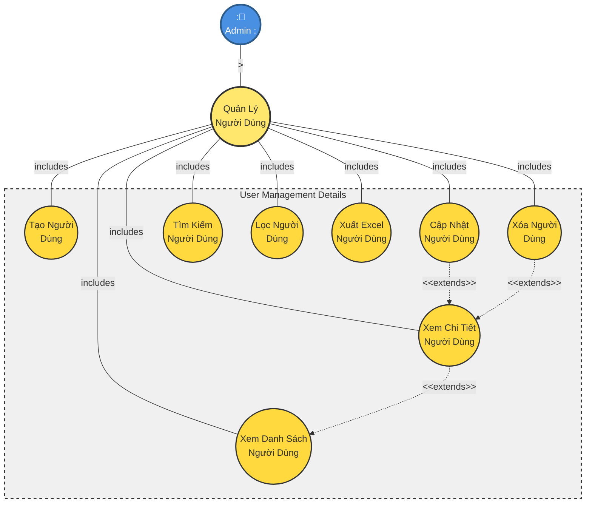

### 2. Admin - Quản Lý Chuyên Khoa (Phân Rã)

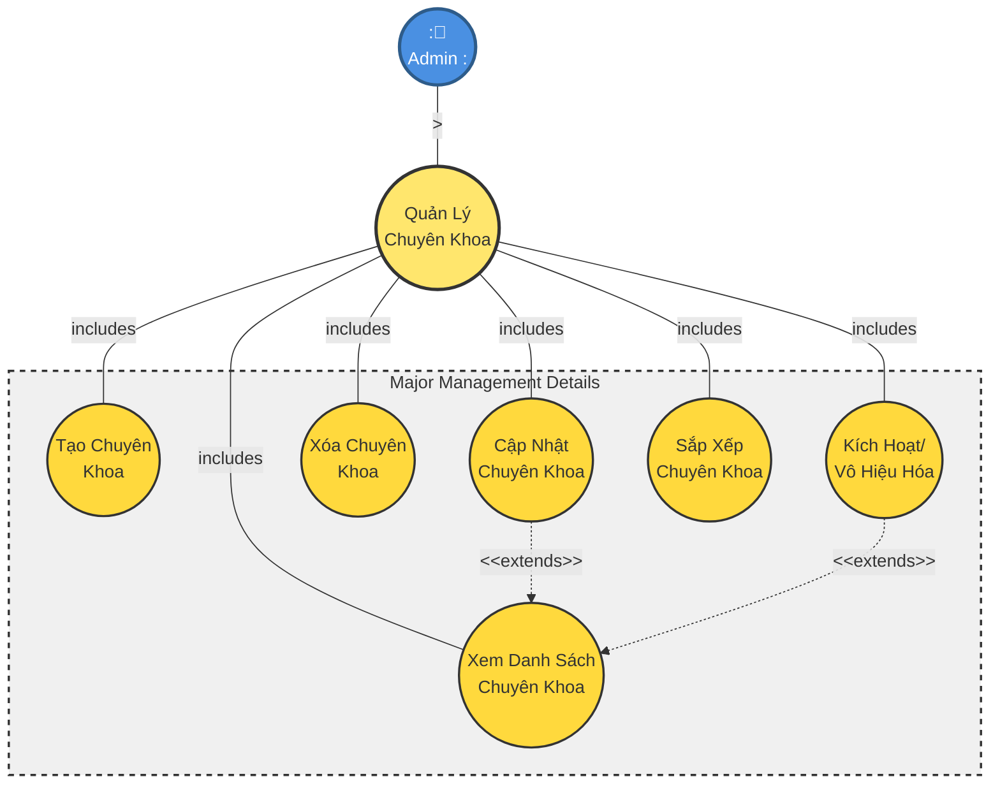

### 3. Admin - Quản Lý Thuốc (Phân Rã)

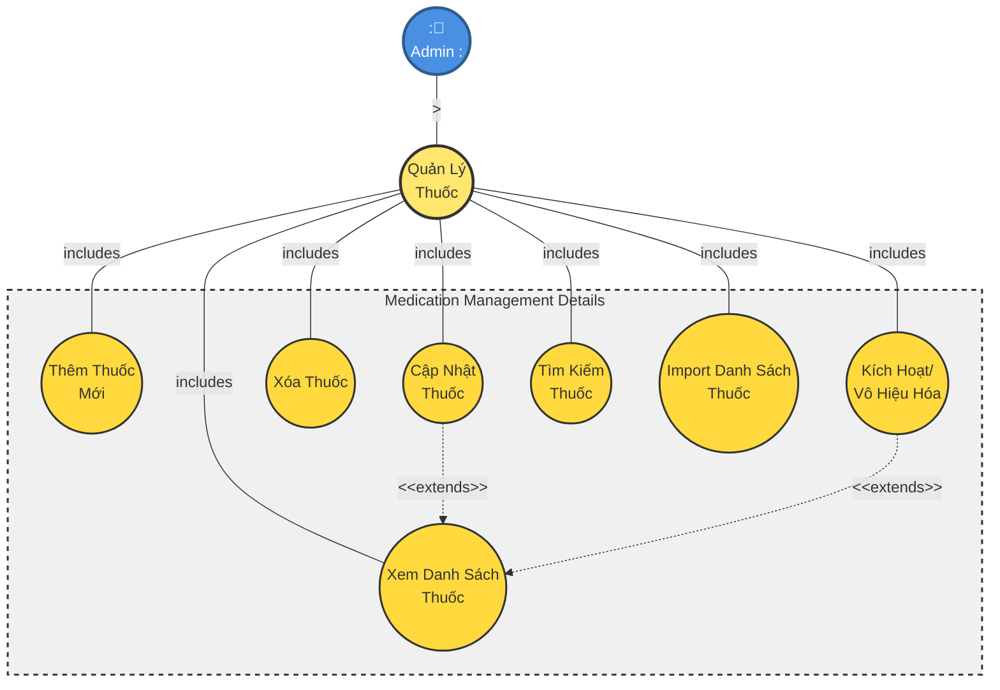

### 4. Doctor - Kê Đơn Thuốc Điện Tử (Phân Rã)

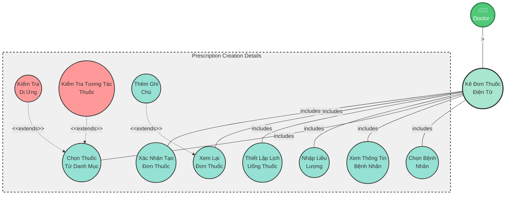

### 5. Patient - Xác Nhận Đã Uống Thuốc (Phân Rã)

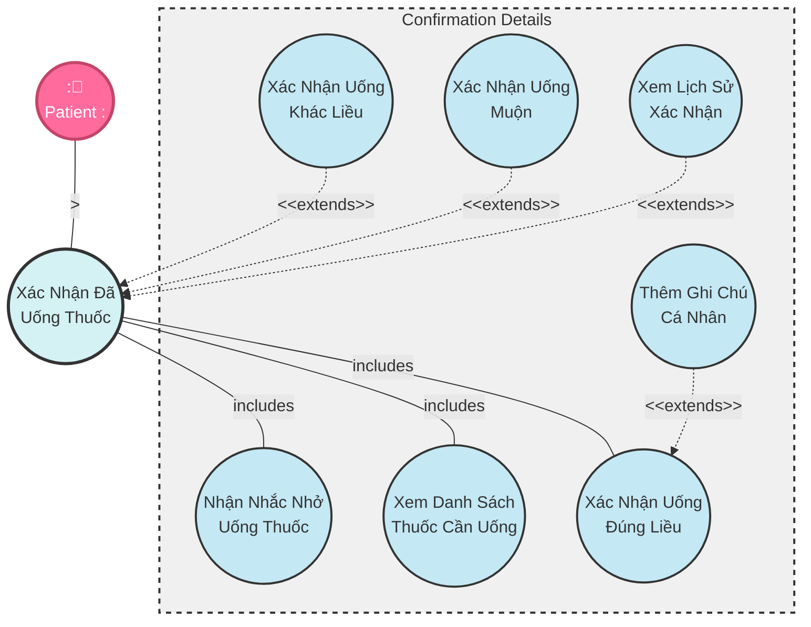

### 6. Doctor - Giám Sát Tuân Thủ Uống Thuốc (Phân Rã)

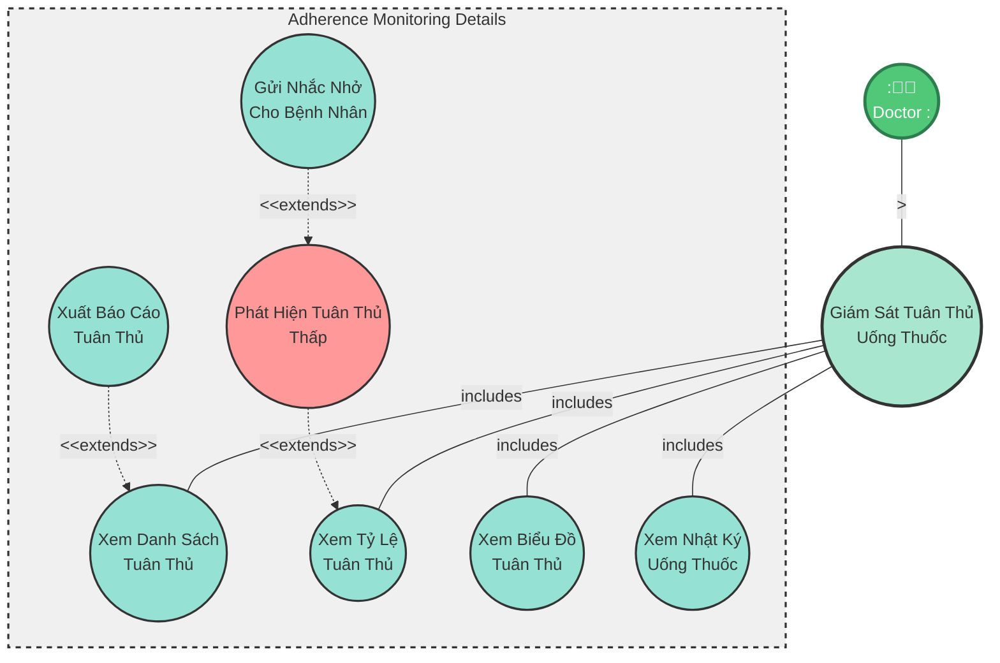

### 7. System - Gửi Nhắc Nhở Uống Thuốc (Phân Rã)

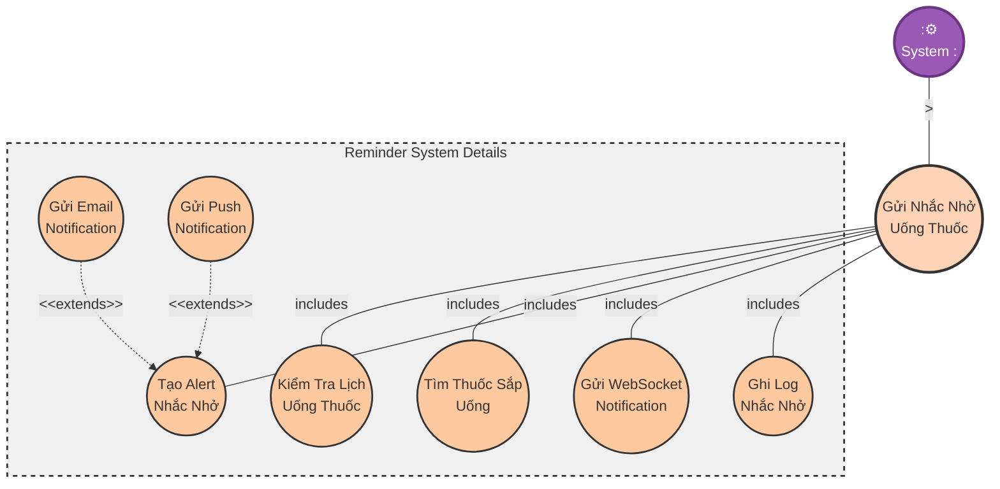

## Use Case Diagram - Chi Tiết Theo Module

### 1. Module Quản Trị (Admin Module)

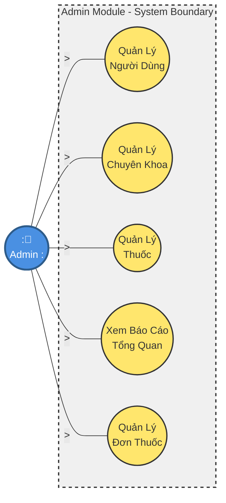

### 2. Module Bác Sĩ (Doctor Module)

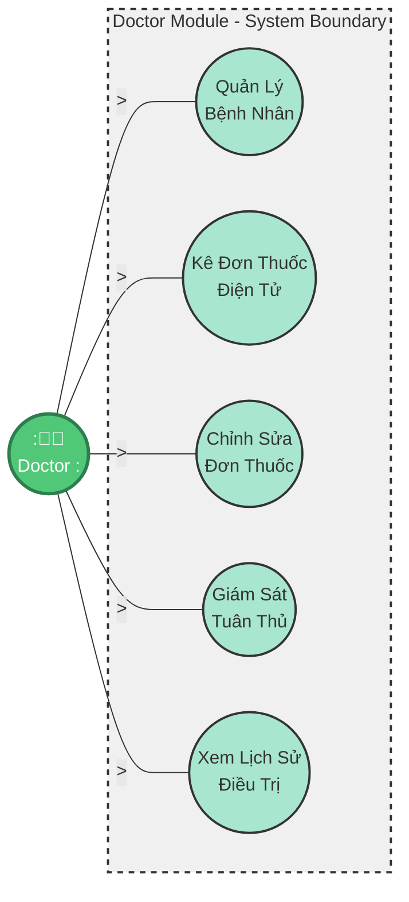

### 3. Module Bệnh Nhân (Patient Module)

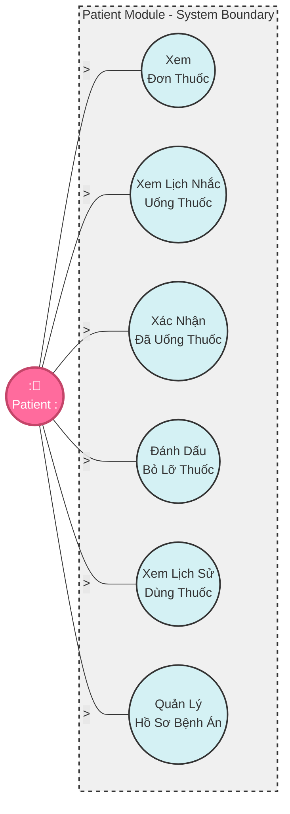

### 4. Module Hệ Thống (System Module)

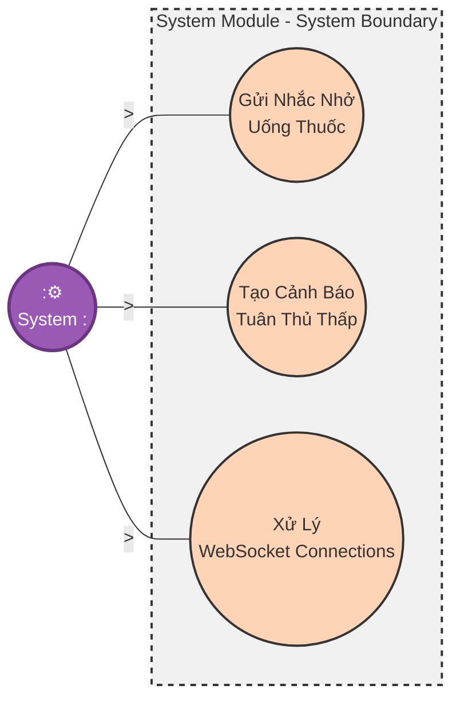

## Mối Quan Hệ Giữa Các Use Cases

### 1. Mối Quan Hệ Include (Bao gồm)

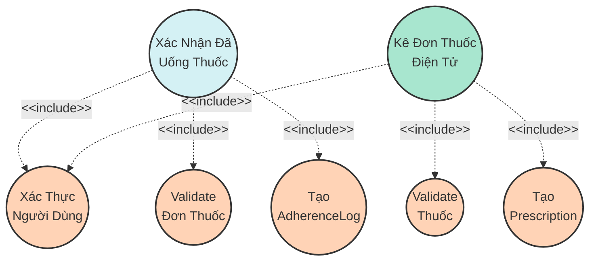

### 2. Mối Quan Hệ Extend (Mở rộng)

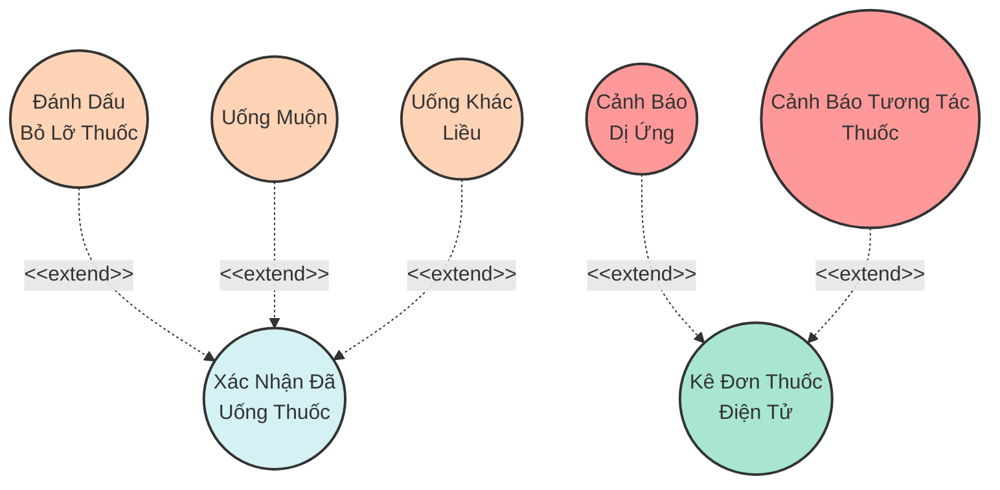

### 3. Luồng Tương Tác Giữa Các Actors

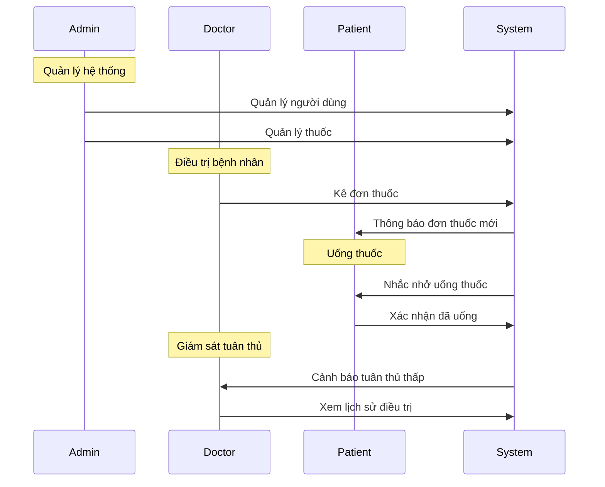

## Mô Tả Chi Tiết Actors

### 1. Admin (Quản trị viên)
- **Mô tả**: Người quản trị hệ thống, có quyền cao nhất
- **Chức năng chính**:
  - Quản lý người dùng (tạo, sửa, xóa)
  - Quản lý chuyên khoa bác sĩ
  - Quản lý danh mục thuốc
  - Xem báo cáo tổng quan
  - Quản lý tất cả đơn thuốc
- **Use Cases**: UC-ADMIN-001 đến UC-ADMIN-005

### 2. Doctor (Bác sĩ)
- **Mô tả**: Bác sĩ điều trị, kê đơn thuốc cho bệnh nhân
- **Chức năng chính**:
  - Quản lý danh sách bệnh nhân được phân công
  - Kê đơn thuốc điện tử
  - Chỉnh sửa đơn thuốc
  - Giám sát tuân thủ uống thuốc của bệnh nhân
  - Xem lịch sử điều trị
- **Use Cases**: UC-DOCTOR-001 đến UC-DOCTOR-005

### 3. Patient (Bệnh nhân)
- **Mô tả**: Người dùng cuối, nhận đơn thuốc và xác nhận uống thuốc
- **Chức năng chính**:
  - Xem đơn thuốc hiện tại
  - Xem lịch nhắc uống thuốc
  - Xác nhận đã uống thuốc
  - Đánh dấu bỏ lỡ thuốc
  - Xem lịch sử dùng thuốc
  - Quản lý hồ sơ bệnh án
- **Use Cases**: UC-PATIENT-001 đến UC-PATIENT-006

### 4. System (Hệ thống)
- **Mô tả**: Hệ thống tự động thực hiện các tác vụ
- **Chức năng chính**:
  - Gửi nhắc nhở uống thuốc tự động
  - Tạo cảnh báo khi tuân thủ thấp
  - Xử lý kết nối WebSocket cho real-time notifications
- **Use Cases**: UC-SYSTEM-001 đến UC-SYSTEM-003

## Tổng Kết

### Lưu Ý Về Phân Rã Use Case

Các Use Case đã được phân rã thành các use case con chi tiết hơn với:

1. **Use Case Tổng Quát**: Ở level cao, mô tả chức năng chính
2. **Use Case Chi Tiết**: Ở level thấp, mô tả các bước cụ thể
3. **Include Relationship**: Sử dụng `---|includes|` để thể hiện use case chi tiết được bao gồm trong use case tổng quát
4. **Extend Relationship**: Sử dụng `-.->|"<<extends>>"|` để thể hiện use case có thể mở rộng use case khác
5. **System Boundary**: Sử dụng subgraph với border nét đứt để nhóm các use case chi tiết

### Thống Kê Use Cases

| Actor | Số Lượng Use Cases | Use Case IDs |
|-------|-------------------|--------------|
| Admin | 5 | UC-ADMIN-001 đến UC-ADMIN-005 |
| Doctor | 5 | UC-DOCTOR-001 đến UC-DOCTOR-005 |
| Patient | 6 | UC-PATIENT-001 đến UC-PATIENT-006 |
| System | 3 | UC-SYSTEM-001 đến UC-SYSTEM-003 |
| **Tổng** | **19** | - |

### Luồng Nghiệp Vụ Chính

1. **Luồng Kê Đơn và Uống Thuốc**:
   - Doctor → Kê đơn thuốc (UC-DOCTOR-002)
   - System → Gửi thông báo đơn thuốc mới
   - Patient → Xem đơn thuốc (UC-PATIENT-001)
   - System → Gửi nhắc nhở uống thuốc (UC-SYSTEM-001)
   - Patient → Xác nhận đã uống thuốc (UC-PATIENT-003)
   - System → Tạo cảnh báo tuân thủ thấp (UC-SYSTEM-002)
   - Doctor → Giám sát tuân thủ (UC-DOCTOR-004)

2. **Luồng Quản Trị**:
   - Admin → Quản lý người dùng (UC-ADMIN-001)
   - Admin → Quản lý thuốc (UC-ADMIN-003)
   - Admin → Xem báo cáo tổng quan (UC-ADMIN-004)

## Lợi Ích Của Use Case Diagram

1. **Hiểu rõ phạm vi**: Giúp hiểu rõ phạm vi và chức năng của hệ thống
2. **Thiết kế hệ thống**: Hỗ trợ thiết kế và phát triển hệ thống
3. **Tài liệu hóa**: Tài liệu hóa các chức năng cho team phát triển
4. **Giao tiếp**: Giúp giao tiếp giữa team về chức năng hệ thống
5. **Testing**: Hỗ trợ thiết kế test cases cho từng use case
6. **Quản lý dự án**: Giúp quản lý và theo dõi tiến độ dự án

