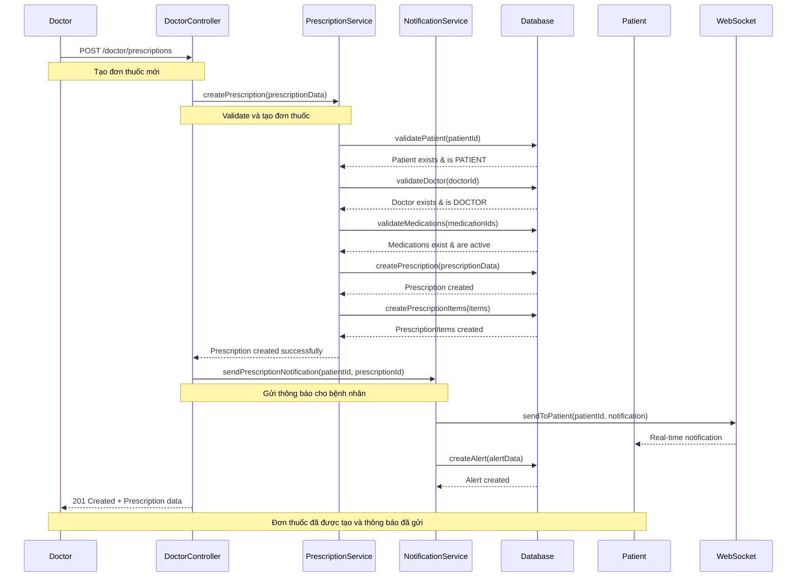
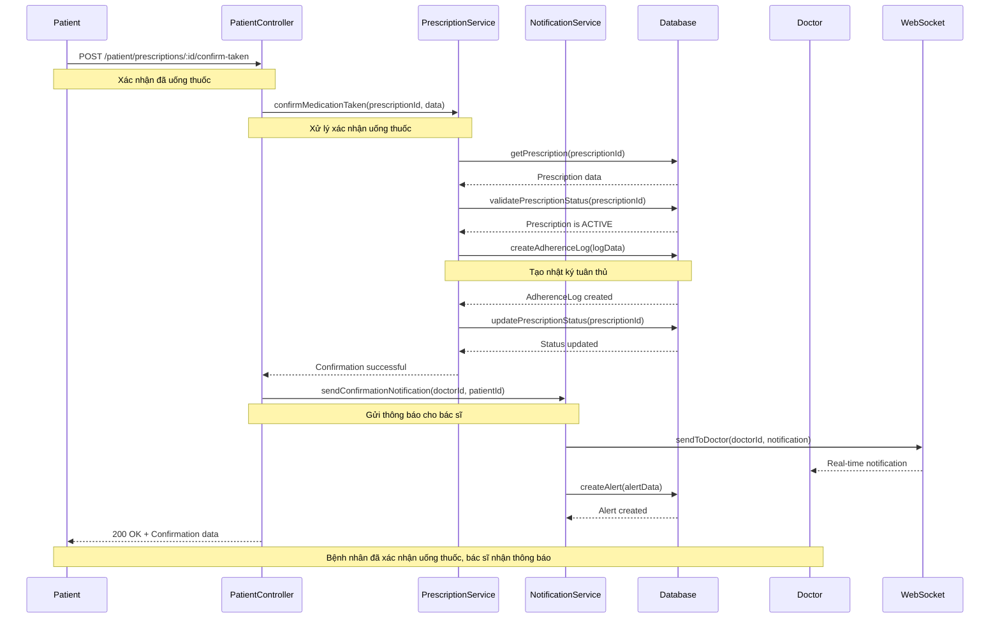
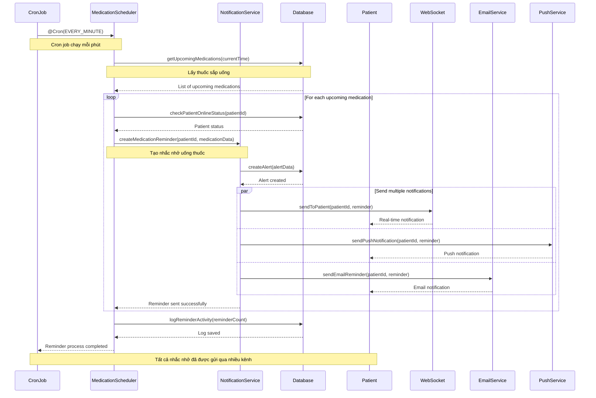
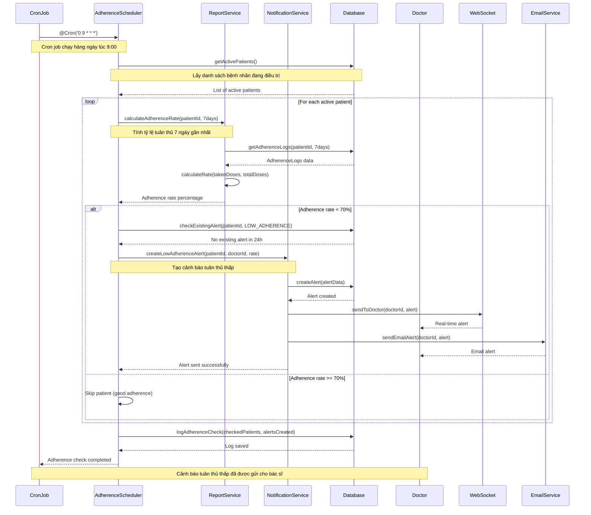
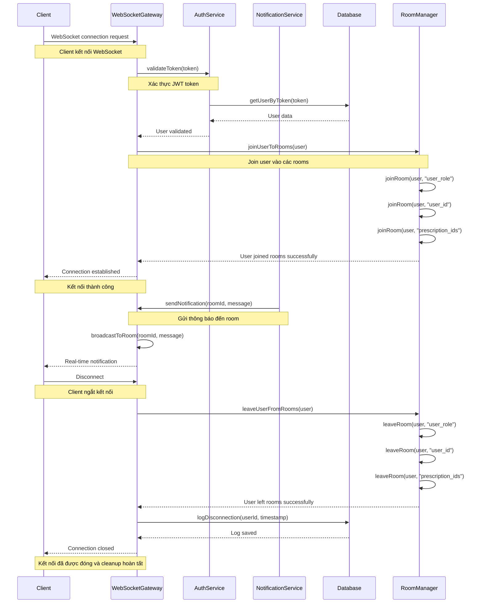
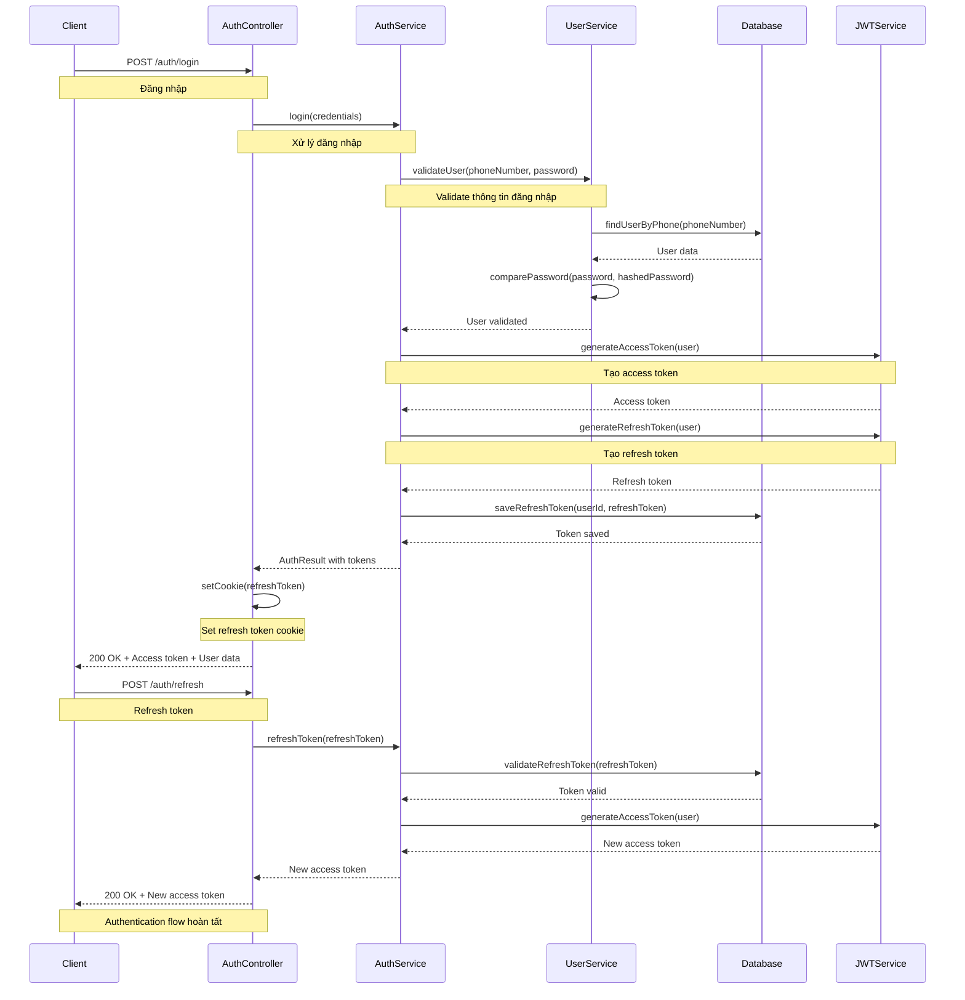
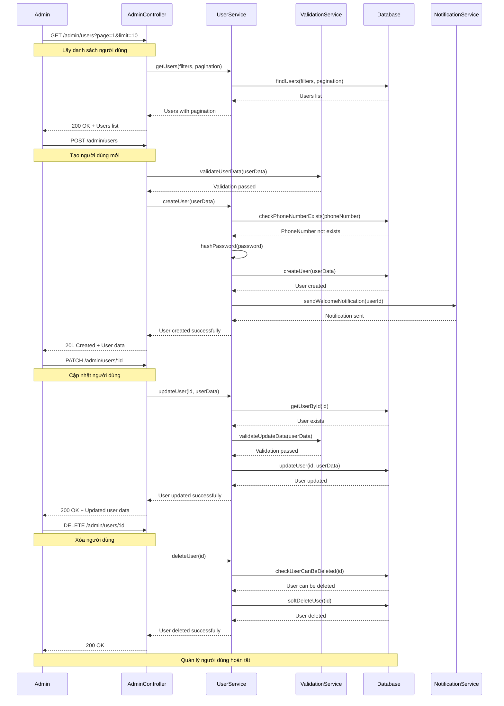
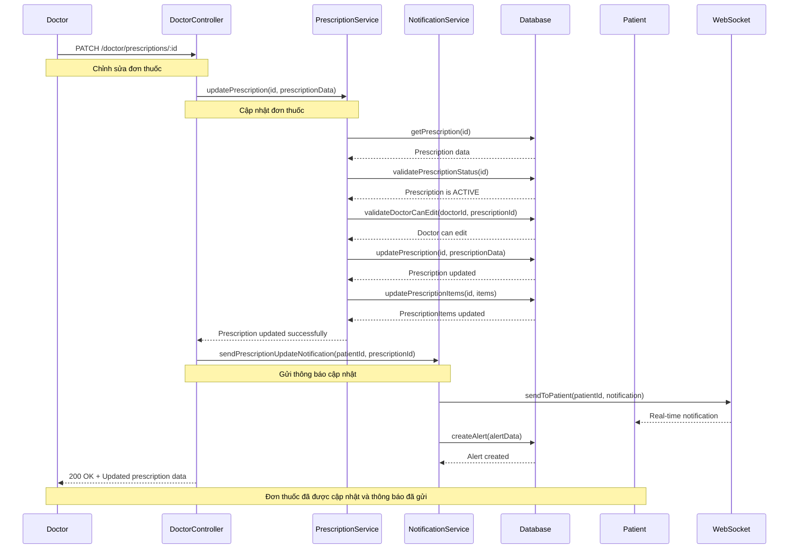
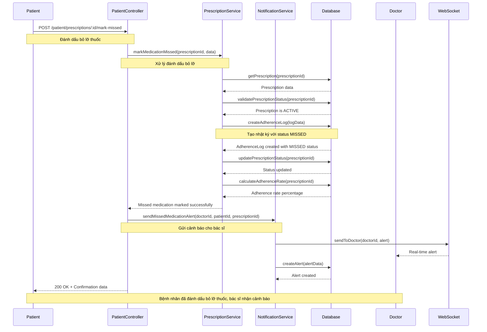

# UML Sequence Diagrams - Medical Management System

## Tổng Quan
Sơ đồ tuần tự UML mô tả luồng tương tác giữa các đối tượng trong các use case quan trọng của hệ thống quản lý y tế.

## 1. Sequence Diagram - Kê Đơn Thuốc Điện Tử

## 2. Sequence Diagram - Xác Nhận Uống Thuốc

## 3. Sequence Diagram - Gửi Nhắc Nhở Uống Thuốc

## 4. Sequence Diagram - Tạo Cảnh Báo Tuân Thủ Thấp

## 5. Sequence Diagram - WebSocket Connection Management

## 6. Sequence Diagram - Authentication Flow

## 7. Sequence Diagram - Admin Quản Lý Người Dùng

## 8. Sequence Diagram - Bác Sĩ Chỉnh Sửa Đơn Thuốc

## 9. Sequence Diagram - Bệnh Nhân Đánh Dấu Bỏ Lỡ Thuốc

## Mô Tả Chi Tiết

### 1. Kê Đơn Thuốc Điện Tử
- **Mục đích**: Mô tả quy trình bác sĩ tạo đơn thuốc mới
- **Các bước chính**:
  1. Doctor gửi request tạo đơn thuốc
  2. Validate thông tin bệnh nhân, bác sĩ, thuốc
  3. Tạo Prescription và PrescriptionItems
  4. Gửi thông báo real-time cho bệnh nhân
  5. Tạo Alert record

### 2. Xác Nhận Uống Thuốc
- **Mục đích**: Mô tả quy trình bệnh nhân xác nhận đã uống thuốc
- **Các bước chính**:
  1. Patient gửi request xác nhận uống thuốc
  2. Validate đơn thuốc và trạng thái
  3. Tạo AdherenceLog record
  4. Cập nhật trạng thái đơn thuốc
  5. Gửi thông báo cho bác sĩ

### 3. Gửi Nhắc Nhở Uống Thuốc
- **Mục đích**: Mô tả quy trình hệ thống tự động gửi nhắc nhở
- **Các bước chính**:
  1. Cron job chạy mỗi phút
  2. Tìm thuốc sắp uống
  3. Tạo Alert record
  4. Gửi thông báo qua nhiều kênh (WebSocket, Push, Email)
  5. Ghi log hoạt động

### 4. Tạo Cảnh Báo Tuân Thủ Thấp
- **Mục đích**: Mô tả quy trình hệ thống tự động tạo cảnh báo
- **Các bước chính**:
  1. Cron job chạy hàng ngày lúc 9:00
  2. Tính tỷ lệ tuân thủ cho từng bệnh nhân
  3. Tạo cảnh báo nếu tỷ lệ < 70%
  4. Gửi cảnh báo cho bác sĩ
  5. Ghi log hoạt động

### 5. WebSocket Connection Management
- **Mục đích**: Mô tả quy trình quản lý kết nối WebSocket
- **Các bước chính**:
  1. Client kết nối WebSocket
  2. Xác thực JWT token
  3. Join user vào các rooms phù hợp
  4. Gửi/nhận thông báo real-time
  5. Cleanup khi disconnect

### 6. Authentication Flow
- **Mục đích**: Mô tả quy trình đăng nhập và refresh token
- **Các bước chính**:
  1. Client gửi thông tin đăng nhập
  2. Validate thông tin user
  3. Tạo access token và refresh token
  4. Set refresh token cookie
  5. Trả về access token và user data

## Lợi Ích Của Sequence Diagrams

1. **Hiểu rõ luồng**: Giúp hiểu rõ luồng tương tác giữa các đối tượng
2. **Debug**: Dễ dàng debug và tìm lỗi trong quy trình
3. **Thiết kế**: Hỗ trợ thiết kế API và service interactions
4. **Tài liệu hóa**: Tài liệu hóa quy trình nghiệp vụ
5. **Giao tiếp**: Giúp giao tiếp giữa team về quy trình hệ thống
