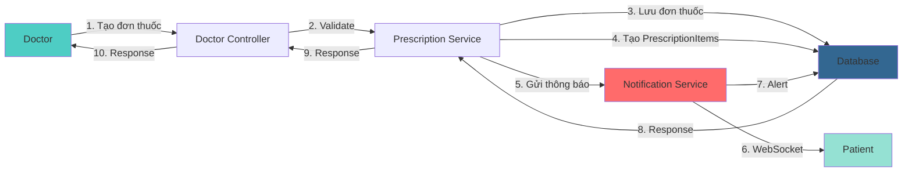
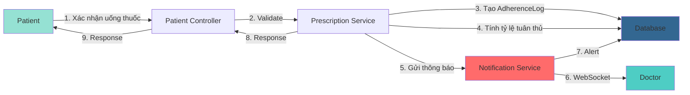
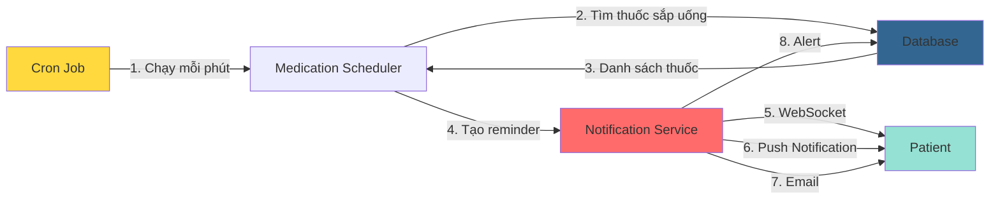
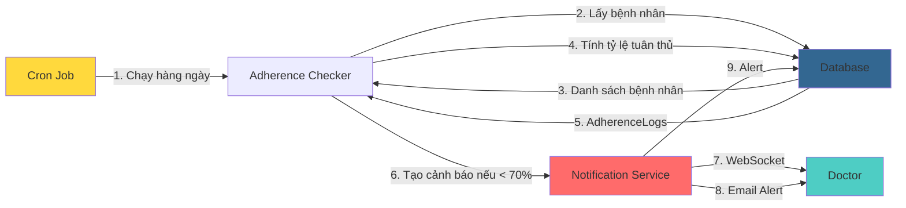
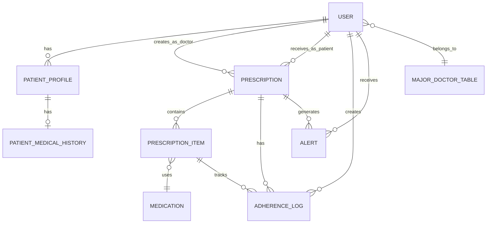
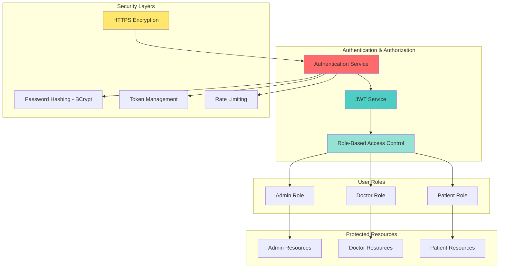
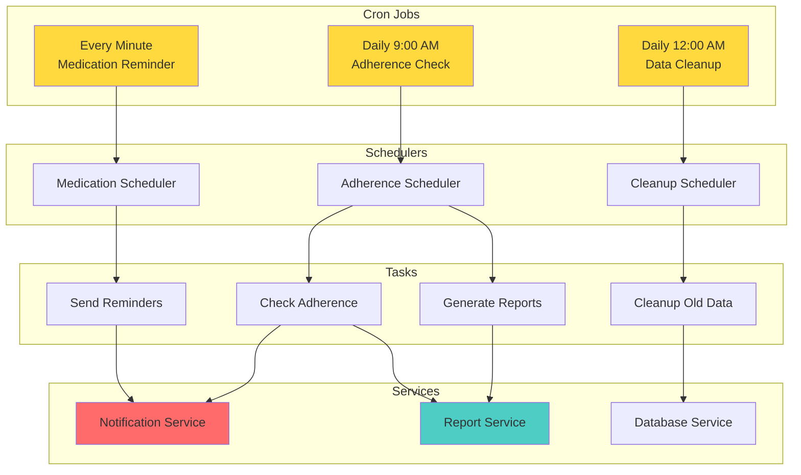

# System Overview Diagram - Medical Management System

## Tổng Quan

Sơ đồ tổng quan hệ thống mô tả kiến trúc tổng thể, các module chính, luồng dữ liệu và mối quan hệ giữa các thành phần trong hệ thống quản lý y tế.

## System Overview - Kiến Trúc Tổng Thể

```mermaid
graph TB
    subgraph "Frontend Layer"
        FE[React Frontend Application]
        UI[UI Components]
        ROUTER[React Router]
        STATE[State Management]
        API_CLIENT[API Client]
    end
    
    subgraph "API Gateway"
        GATEWAY[API Gateway]
        AUTH_MW[Authentication Middleware]
        RATE_LIMIT[Rate Limiting]
        CORS[CORS Handler]
    end
    
    subgraph "Backend Services - NestJS"
        subgraph "Auth Module"
            AUTH_CTRL[Auth Controller]
            AUTH_SVC[Auth Service]
            JWT_SVC[JWT Service]
        end
        
        subgraph "User Module"
            USER_CTRL[User Controller]
            USER_SVC[User Service]
        end
        
        subgraph "Prescription Module"
            PRESC_CTRL[Prescription Controller]
            PRESC_SVC[Prescription Service]
            ADHERENCE_SVC[Adherence Service]
        end
        
        subgraph "Doctor Module"
            DOCTOR_CTRL[Doctor Controller]
            DOCTOR_SVC[Doctor Service]
        end
        
        subgraph "Patient Module"
            PATIENT_CTRL[Patient Controller]
            PATIENT_SVC[Patient Service]
        end
        
        subgraph "Notification Module"
            NOTIF_CTRL[Notification Controller]
            NOTIF_SVC[Notification Service]
            WS_GATEWAY[WebSocket Gateway]
        end
        
        subgraph "Report Module"
            REPORT_CTRL[Report Controller]
            REPORT_SVC[Report Service]
        end
    end
    
    subgraph "Data Layer"
        PRISMA[Prisma ORM]
        POSTGRES[(PostgreSQL Database)]
        REDIS[(Redis Cache)]
    end
    
    subgraph "External Services"
        EMAIL_SVC[Email Service]
        SMS_SVC[SMS Service]
        PUSH_SVC[Push Notification Service]
    end
    
    subgraph "Background Jobs"
        CRON[Cron Jobs]
        MED_SCHEDULER[Medication Scheduler]
        ADH_SCHEDULER[Adherence Checker]
    end
    
    %% Frontend connections
    FE --> UI
    FE --> ROUTER
    FE --> STATE
    FE --> API_CLIENT
    API_CLIENT --> GATEWAY
    
    %% API Gateway connections
    GATEWAY --> AUTH_MW
    GATEWAY --> RATE_LIMIT
    GATEWAY --> CORS
    GATEWAY --> AUTH_CTRL
    GATEWAY --> USER_CTRL
    GATEWAY --> PRESC_CTRL
    GATEWAY --> DOCTOR_CTRL
    GATEWAY --> PATIENT_CTRL
    GATEWAY --> NOTIF_CTRL
    GATEWAY --> REPORT_CTRL
    
    %% Controller to Service connections
    AUTH_CTRL --> AUTH_SVC
    USER_CTRL --> USER_SVC
    PRESC_CTRL --> PRESC_SVC
    PRESC_CTRL --> ADHERENCE_SVC
    DOCTOR_CTRL --> DOCTOR_SVC
    DOCTOR_CTRL --> PRESC_SVC
    PATIENT_CTRL --> PATIENT_SVC
    PATIENT_CTRL --> PRESC_SVC
    NOTIF_CTRL --> NOTIF_SVC
    REPORT_CTRL --> REPORT_SVC
    
    %% Service to Data Layer
    AUTH_SVC --> PRISMA
    USER_SVC --> PRISMA
    PRESC_SVC --> PRISMA
    DOCTOR_SVC --> PRISMA
    PATIENT_SVC --> PRISMA
    NOTIF_SVC --> PRISMA
    REPORT_SVC --> PRISMA
    
    PRISMA --> POSTGRES
    AUTH_SVC --> REDIS
    
    %% Notification connections
    NOTIF_SVC --> WS_GATEWAY
    NOTIF_SVC --> EMAIL_SVC
    NOTIF_SVC --> SMS_SVC
    NOTIF_SVC --> PUSH_SVC
    
    %% Background Jobs connections
    CRON --> MED_SCHEDULER
    CRON --> ADH_SCHEDULER
    MED_SCHEDULER --> NOTIF_SVC
    ADH_SCHEDULER --> NOTIF_SVC
    ADH_SCHEDULER --> REPORT_SVC
    
    %% Cross-module connections
    PRESC_SVC --> NOTIF_SVC
    ADHERENCE_SVC --> NOTIF_SVC
    ADHERENCE_SVC --> REPORT_SVC
    
    style FE fill:#61dafb
    style GATEWAY fill:#ff6b6b
    style POSTGRES fill:#336791
    style REDIS fill:#dc382d
    style WS_GATEWAY fill:#010101
    style CRON fill:#ffd93d
```

## System Overview - Luồng Dữ Liệu Chính

### 1. Luồng Kê Đơn Thuốc

### 2. Luồng Uống Thuốc

### 3. Luồng Nhắc Nhở Tự Động

### 4. Luồng Cảnh Báo Tuân Thủ

## System Overview - Mô Hình Dữ Liệu Tổng Quan

## System Overview - Phân Quyền và Bảo Mật

## System Overview - Real-time Communication

```mermaid
graph TB
    subgraph "Client Side"
        FE[React Frontend]
        WS_CLIENT[WebSocket Client]
    end
    
    subgraph "Server Side"
        WS_GATEWAY[WebSocket Gateway]
        WS_SERVICE[WebSocket Service]
        ROOM_MGR[Room Manager]
    end
    
    subgraph "Notification Types"
        REMINDER[Medication Reminders]
        ALERT[Adherence Alerts]
        UPDATE[Prescription Updates]
        SYSTEM[System Notifications]
    end
    
    subgraph "Delivery Channels"
        WS[WebSocket]
        EMAIL[Email]
        PUSH[Push Notification]
        SMS[SMS]
    end
    
    FE --> WS_CLIENT
    WS_CLIENT <--> WS_GATEWAY
    WS_GATEWAY --> WS_SERVICE
    WS_SERVICE --> ROOM_MGR
    
    REMINDER --> WS_SERVICE
    ALERT --> WS_SERVICE
    UPDATE --> WS_SERVICE
    SYSTEM --> WS_SERVICE
    
    WS_SERVICE --> WS
    WS_SERVICE --> EMAIL
    WS_SERVICE --> PUSH
    WS_SERVICE --> SMS
    
    style WS_GATEWAY fill:#010101
    style WS_SERVICE fill:#ff6b6b
    style REMINDER fill:#ffe66d
    style ALERT fill:#ff9999
```

## System Overview - Background Processing

## Tổng Kết

### Các Thành Phần Chính

1. **Frontend Layer**: React application với UI components, routing, state management
2. **API Gateway**: Xử lý authentication, rate limiting, CORS
3. **Backend Services**: NestJS modules cho các chức năng chính
4. **Data Layer**: PostgreSQL database với Prisma ORM và Redis cache
5. **External Services**: Email, SMS, Push notification services
6. **Background Jobs**: Cron jobs cho scheduled tasks

### Luồng Dữ Liệu Chính

1. **Kê Đơn Thuốc**: Doctor → Controller → Service → Database → Notification → Patient
2. **Uống Thuốc**: Patient → Controller → Service → Database → Notification → Doctor
3. **Nhắc Nhở Tự Động**: Cron → Scheduler → Database → Notification → Patient
4. **Cảnh Báo Tuân Thủ**: Cron → Checker → Database → Notification → Doctor

### Tính Năng Nổi Bật

1. **Real-time Communication**: WebSocket cho thông báo tức thời
2. **Automated Scheduling**: Cron jobs cho nhắc nhở và kiểm tra tự động
3. **Role-Based Access Control**: Phân quyền chi tiết theo vai trò
4. **Data Analytics**: Báo cáo và thống kê tuân thủ
5. **Multi-channel Notifications**: WebSocket, Email, SMS, Push

## Lợi Ích Của System Overview Diagram

1. **Hiểu rõ kiến trúc**: Giúp hiểu rõ kiến trúc tổng thể của hệ thống
2. **Thiết kế hệ thống**: Hỗ trợ thiết kế và phát triển hệ thống
3. **Tài liệu hóa**: Tài liệu hóa kiến trúc cho team phát triển
4. **Giao tiếp**: Giúp giao tiếp giữa team về kiến trúc hệ thống
5. **Onboarding**: Hỗ trợ onboard team members mới
6. **Maintenance**: Dễ dàng bảo trì và mở rộng hệ thống

