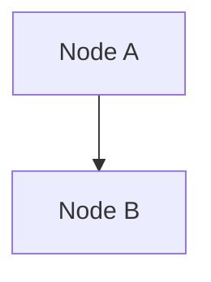

# Hướng Dẫn Cài Đặt Extension Để Xem UML Diagrams

## Các Extension Khuyến Nghị

### 1. Markdown Preview Mermaid Support (Khuyến nghị) ⭐

**Extension ID**: `bierner.markdown-mermaid`

**Cài đặt**:
1. Mở Cursor/VS Code
2. Nhấn `Ctrl+Shift+X` (hoặc `Cmd+Shift+X` trên Mac) để mở Extensions
3. Tìm "Markdown Preview Mermaid Support"
4. Click **Install**

**Cách sử dụng**:
1. Mở file markdown (ví dụ: `00-Use-Case-Diagram.md`)
2. Nhấn `Ctrl+Shift+V` (hoặc `Cmd+Shift+V` trên Mac) để mở Markdown Preview
3. Các diagram Mermaid sẽ tự động render

**Ưu điểm**:
- ✅ Hỗ trợ đầy đủ Mermaid syntax
- ✅ Tích hợp tốt với markdown preview mặc định
- ✅ Nhẹ và ổn định
- ✅ Tự động render khi mở preview

---

### 2. Markdown Preview Enhanced

**Extension ID**: `shd101wyy.markdown-preview-enhanced`

**Cài đặt**:
1. Mở Extensions (`Ctrl+Shift+X`)
2. Tìm "Markdown Preview Enhanced"
3. Click **Install**

**Cách sử dụng**:
1. Mở file markdown
2. Nhấn `Ctrl+K V` (hoặc `Cmd+K V` trên Mac) để mở preview bên cạnh
3. Hoặc click chuột phải → "Markdown Preview Enhanced: Open Preview to the Side"

**Ưu điểm**:
- ✅ Hỗ trợ nhiều loại diagram (Mermaid, PlantUML, etc.)
- ✅ Có thể export ra PDF, HTML
- ✅ Hỗ trợ MathJax
- ✅ Nhiều tính năng nâng cao

---

### 3. Mermaid Preview

**Extension ID**: `vstirbu.vscode-mermaid-preview`

**Cài đặt**:
1. Mở Extensions (`Ctrl+Shift+X`)
2. Tìm "Mermaid Preview"
3. Click **Install**

**Cách sử dụng**:
1. Mở file markdown chứa Mermaid diagram
2. Click vào icon Mermaid ở status bar
3. Hoặc nhấn `Ctrl+Shift+P` → gõ "Mermaid Preview"

**Ưu điểm**:
- ✅ Chuyên dụng cho Mermaid
- ✅ Preview riêng biệt, không ảnh hưởng markdown preview
- ✅ Hỗ trợ export diagram

---

## Cài Đặt Nhanh (Command Line)

Bạn có thể cài đặt extension qua terminal:

```bash
# Cài Markdown Preview Mermaid Support (khuyến nghị)
code --install-extension bierner.markdown-mermaid

# Hoặc nếu dùng Cursor
cursor --install-extension bierner.markdown-mermaid
```

---

## Kiểm Tra Extension Đã Hoạt Động

Sau khi cài đặt:

1. Mở file `00-Use-Case-Diagram.md`
2. Nhấn `Ctrl+Shift+V` để mở preview
3. Cuộn xuống phần có ````mermaid`
4. Bạn sẽ thấy diagram được render thay vì chỉ là code text

**Ví dụ**: Nếu thấy diagram vẽ được nghĩa là extension đã hoạt động! ✅

---

## Troubleshooting

### Vấn đề: Diagram không hiển thị

**Giải pháp 1**: Đảm bảo syntax Mermaid đúng


**Giải pháp 2**: Reload window
- Nhấn `Ctrl+Shift+P` (hoặc `Cmd+Shift+P`)
- Gõ "Reload Window"
- Chọn "Developer: Reload Window"

**Giải pháp 3**: Kiểm tra extension đã được enable
- Mở Extensions
- Tìm extension đã cài
- Đảm bảo nó đã được enable (không bị disable)

**Giải pháp 4**: Thử extension khác
- Nếu `bierner.markdown-mermaid` không hoạt động
- Thử cài `shd101wyy.markdown-preview-enhanced`

---

## Các Loại Diagram Hỗ Trợ

Với extension đã cài, bạn có thể xem:

✅ **Use Case Diagrams** - `00-Use-Case-Diagram.md`
✅ **Sequence Diagrams** - `02-Sequence-Diagrams.md`
✅ **Activity Diagrams** - `03-Activity-Diagrams.md`
✅ **State Machine Diagrams** - `04-State-Machine-Diagrams.md`
✅ **Component Diagrams** - `05-Component-Diagrams.md`
✅ **System Overview** - `06-System-Overview.md`
✅ **Class Diagram** - `01-Class-Diagram.md`

---

## Tips

1. **Split View**: Nhấn `Ctrl+\` để chia màn hình, một bên code, một bên preview
2. **Auto Refresh**: Preview tự động refresh khi bạn sửa file markdown
3. **Zoom**: Có thể zoom in/out trong preview để xem diagram rõ hơn
4. **Export**: Một số extension cho phép export diagram ra PNG, SVG

---

## Tài Liệu Tham Khảo

- [Mermaid Official Docs](https://mermaid.js.org/)
- [Markdown Preview Mermaid Support](https://marketplace.visualstudio.com/items?itemName=bierner.markdown-mermaid)
- [Markdown Preview Enhanced](https://marketplace.visualstudio.com/items?itemName=shd101wyy.markdown-preview-enhanced)

